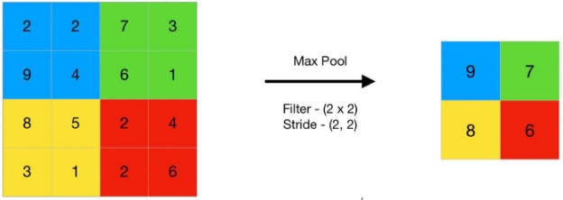

# Karbi Language Number Detection


## Overview

The Karbi Language Number Detection project employs a Convolutional Neural Network (CNN) to accurately identify numeric characters in the Karbi language. Karbi is a regional language spoken in North East India, and finding data sets for this language can be quite challenging. To overcome this limitation, we've leveraged image generation techniques to create a diverse dataset for training our model.

## Features

- **Convolutional Neural Network:** We've implemented a CNN architecture tailored for character recognition tasks.
- **Data Augmentation:** Image generation techniques are used to expand the dataset and improve the model's robustness.
- **High Accuracy:** Our model achieves an impressive accuracy rate of approximately 91%.

**Model Implementation:**  

1. Dataset is prepared with prepared with 10 classes with 244 images and 61 images per train and test folder respectively.** 
1. The Required packages are imported like tensorflow,keras, pandas, numpy, matplotlib.** 
1. **The Sequential Model is made with various Convolution layer to colvolute or filter each images.**  

In the context of CNN, convolution is a linear operation involving the multiplication of a set of weights with the input images represented by metrics similar to traditional neural networks. Here an array of weights is called a filter or kernel. 


I used 64 filters with size 3x3 each. Total 4 convolution layers are used. [**Source** ](https://analyticsindiamag.com/what-is-a-convolutional-layer/#:~:text=In%20the%20context%20of%20CNN,called%20a%20filter%20or%20kernel.)

4. **Next I added Max Pooling layers following the Convolution layer.** Pooling layers are used to reduce the dimensions of the feature maps. Thus, it reduces the number of parameters to learn and the amount of computation performed in the network.The pooling layer summarizes the 

features present in a region of the feature map generated by a convolution layer. So, further operations are performed on summarised features instead of precisely positioned features generated by the convolution layer. This makes the model more robust to variations in the position of the features in the input image. 

**Max pooling** is a pooling operation that selects the maximum element from the region of the feature map covered by the filter. Thus, the output after max-pooling layer would be a feature map containing the most prominent features of the previous feature map. [ Source ](https://www.geeksforgeeks.org/cnn-introduction-to-pooling-layer/#:~:text=Pooling%20layers%20are%20used%20to,generated%20by%20a%20convolution%20layer.)



5. Then next is a Flatten layer that converts the 2D matrix data to a 1D vector before building the fully connected layers. 
5. Then we will use a regularization layer called Dropout. It is configured to randomly exclude 50% of neurons in the layer in order to reduce **overfitting.** 
5. **Then I used a fully connected layer(Dense) with 1024 neurons and “relu” activation function.** 

Fully Connected Layer is simply,[` `*feed forward neural networks.](https://en.wikipedia.org/wiki/Feedforward_neural_network)* Fully Connected Layers form the last few layers in the network.The **input** to the fully connected layer is the output from the *final* Pooling or Convolutional Layer, which is ***flattened*** and then fed into the fully connected layer. 

[**Source** ](https://towardsdatascience.com/convolutional-neural-network-17fb77e76c05#:~:text=Fully%20Connected%20Layer%20is%20simply,into%20the%20fully%20connected%20layer.)

8. Finally, the output layer which has 10 neurons for the 10 classes and a “*softmax*” activation function to output probability-like predictions for each class. (Softmax is a mathematical function that converts a vector of 

numbers into a vector of probabilities, where the probabilities of each value are proportional to the relative scale of each value in the vector. ) 

9. After that The model is compiled using RMSProp optimizer for optimizing the model and  loss – categorical\_crossentropy. (Used as a loss function for multi-class classification model where there are two or more output labels.) 
9. After making the Sequential model I feed these train and test dataset to the model and trained it for 15 epochs. 
9. The Train Test Accuracy vs loss graphs are plotted using the Matplotlib library. 
9. After getting a decent accuracy of prediction after tuning with different parameters I saved the model as .h5. 

After that a GUI detection is made using tkinter where we used the above model to predict any number that we draw on a pop up screen. 

**GUI Detection Implementation:** 

TKinter is used for this part. Tkinter is the standard GUI library for Python. Python when combined with Tkinter provides a fast and easy way to create GUI applications. 

1. Importing the required packages (PIL, numpy, tkinter ) and model. 
1. Loading the model 
1. Creating a function for creating a new Image. In the function first I defined the dimension of images. Than I added methods to save the image drawn in a specified folder, A paint method, that used to draw the required input , A canvas where the number is to be drawn.  
1. I also created a delsete function to delete the image that was saved using save function. 
1. Now the main part. The Draw and guess the number function. Here it first calls the create image function so that the user can write a number. The number is than saved as a image in a specified folder and that image is now use to predict , what number it is, by feeding it to our Model.  

Model.predict gives a **2D array** , where the inside array consists of 0 and 1 Example : if the image is number ‘5’ than model.predict would return this: 


Here we can see index 5 has value 1. 

Thus ,to output the results in a understandable way with text, I used If else statements. 

6. The image is than deleted immediately after prediction using the delete function. 

Also we made a **flutter app**. For Android compatibility I converted the .h5 keras model to Tensorflow lite (tflite) model. Than I used this tflite model In the app for prediction. 

**ALGORITHMS AND FRAMEWORKS** 

**CNN:** A Convolutional neural network (CNN) is a type of[ artificial neural ](https://www.techtarget.com/searchenterpriseai/definition/neural-network)

[network ](https://www.techtarget.com/searchenterpriseai/definition/neural-network)used in[ image recognition ](https://www.techtarget.com/searchenterpriseai/definition/image-recognition)and processing that is specifically designed to process pixel data. CNNs are powerful image processing, artificial intelligence (AI) that use deep learning to perform both generative and descriptive tasks, often using machine vision that includes image and video recognition. CNN is performed using various layers or steps like convolution, pooling, etc. 

**FLUTTER:** Flutter is an open source framework by Google for building beautiful, natively compiled, multi-platform applications from a single codebase. It uses Dart as programming language 

Technologies used: 

1. Tensorflow ( ML framework ) for making the CNN model  
1. Tkinter ( Python GUI package ) for the pop up GUI for drawing numbers 
1. Google’s Flutter ( for making the Android App ) 

Programming Languages: 

1. Python 
1. Dart
   
## Installation

1. Clone the repository:

   ```bash
   git clone https://github.com/yourusername/Karbi-Language-Number-Detection.git
